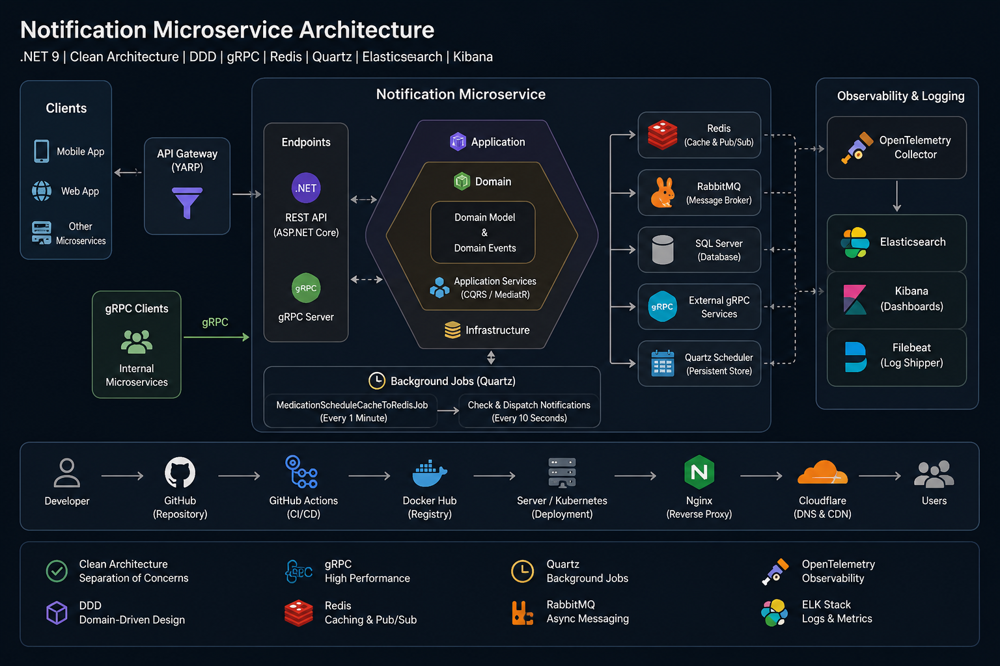

# Base

  

Base is a clean architecture starter framework for building maintainable .NET applications.  
This repository is currently aligned with the `upgrade/dotnet-10` branch and is designed to help you start from a structured foundation instead of a scattered project layout.

## What this project is for

This base template is meant for teams and developers who want:

- a clean separation of concerns
- a predictable project structure
- DDD-friendly layering
- extensibility for real-world applications
- a foundation that can evolve from simple services to microservices

The goal is not to provide a toy sample. The goal is to provide a reusable starting point for production-oriented development.

## Architecture overview

The repository is organized around a clean and modular structure:

- **Application layer** for use cases, orchestration, and business workflows
- **Domain layer** for entities, value objects, aggregates, and domain rules
- **Infrastructure layer** for persistence, messaging, external systems, and implementation details
- **API / endpoints** for exposing the application to consumers
- **Shared utilities and extensions** for cross-cutting concerns

In other words: business logic stays protected, infrastructure stays replaceable, and APIs stay thin.

## Included concepts

Depending on the modules you use from the base framework, the solution is designed to support patterns such as:

- Clean Architecture
- Domain-Driven Design
- CQRS
- modular project organization
- reusable infrastructure helpers
- background jobs
- messaging integration
- observability-ready design

## Repository structure

Typical top-level folders include:

- `src` — main source code
- `samples` — example usages and reference implementations
- `Utility` — helper tools and supporting utilities
- `Extentsions` — framework extensions and reusable building blocks

There are also solution-level files such as:

- `Base.sln`
- `README.md`
- `LICENSE`
- Docker-related files
- package/build helper scripts

## How the base is intended to work

The framework is built so that your application code does not depend directly on the outer technical concerns.

A practical flow looks like this:

1. A client calls an API endpoint.
2. The endpoint delegates to an application use case.
3. The application layer coordinates the operation.
4. The domain layer enforces business rules.
5. Infrastructure handles database, cache, queue, or external service access.
6. Cross-cutting concerns are applied without polluting business logic.

That is the core value of the template.

## Why this structure matters

A lot of .NET projects start fast and become painful later because everything is mixed together.  
This base tries to prevent that by enforcing boundaries early.

Benefits:

- easier maintenance
- easier testing
- less coupling
- clearer ownership of responsibilities
- safer refactoring
- better long-term scalability

## Current branch

This README applies to the `upgrade/dotnet-10` branch, which indicates the project is being aligned with the .NET 10 upgrade path.

That matters because framework versions change APIs, hosting behavior, package compatibility, and deployment assumptions. A clean base template is especially useful during such upgrades because it reduces the risk of upgrade-related chaos spreading across the solution.

## Example use cases

You can use this base for:

- CRUD business applications
- internal enterprise systems
- notification services
- HR / payroll services
- microservice backends
- modular monoliths
- API-first products

## Getting started

A typical workflow is:

1. Clone the repository.
2. Restore dependencies.
3. Build the solution.
4. Run the sample or target service.
5. Replace sample modules with your own business modules.
6. Keep the architecture boundaries intact.

## Design principles

This framework follows a few strict rules:

- domain logic should not depend on infrastructure
- application logic should not be aware of delivery details
- endpoints should be thin
- reusable code should be extracted into shared modules
- technical concerns should be isolated
- the structure should remain readable as the codebase grows

## If you are extending the base

When adding new features, prefer this order:

- define the business need in the domain
- implement the use case in the application layer
- connect persistence or messaging in infrastructure
- expose it through the endpoint layer
- keep external dependencies behind abstractions

That approach keeps the template clean instead of turning it into another monolith with folders.

## Technology direction

This repository is clearly centered around modern .NET development and currently contains a codebase dominated by C# with a small Dockerfile/HTML footprint.

## Screenshot / banner

The image below is a suitable visual banner for the repository because it communicates the exact intent of the base framework: clean architecture, DDD, gRPC, Redis, Quartz, observability, and deployment flow.

## License

This project is licensed under the MIT License.

## Repository note

The repository currently contains a very minimal README on the `upgrade/dotnet-10` branch, so replacing it with a full project description will make the repo much more useful to visitors and contributors.
